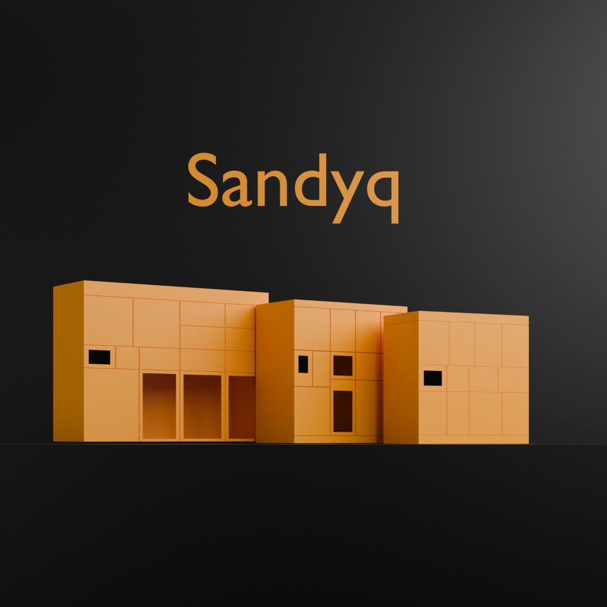

# sandyq store

Done by sse_evn , justleha

# Renting Items via App and Lockers

## Project Description
Our project offers a unique opportunity to rent various items through a convenient mobile application and lockers. We connect users, allowing them to:

1. **Rent items from lockers** — choose the desired item, pay for the rental, and pick it up from the nearest locker.
2. **Rent items from other users** — find the items you need, contact the owner, and arrange the rental via the app.

## Key Features
- **Item Catalog**: Easy search and filters to find the desired item.
- **Booking and Payment**: Simple and secure rental processing directly in the app.
- **Locker Integration**: Pick up items from a locker at your convenience.
- **Personal Account**: Manage rentals, view rental history, and leave feedback.
- **User Interaction**: Communicate with other users to discuss rental details.

## Advantages
- **Convenience**: Everything you need is available in a single app.
- **Accessibility**: Lockers are located across the city for your ease of access.
- **Flexibility**: Rent items either from lockers or directly from other users.
- **Cost-Efficiency**: No need to purchase items you rarely use — just rent them!

## Technologies
- **Mobile Application**: Built using Flutter for iOS and Android support.
- **Locker Integration**: Seamless interaction with hardware for automated item delivery.
- **Database**: Mysql for storing user, item, and rental information.
- **Maps**: OSM API for displaying locker locations.

## How It Works
1. **Choose an Item**: Find the item you need in the app's catalog.
2. **Process the Rental**: Select the delivery method — from a locker or directly from the owner.
3. **Pick Up the Item**: Either from a locker or by meeting the owner.
4. **Return the Item**: Return it to a locker or hand it back to the owner after the rental period.

